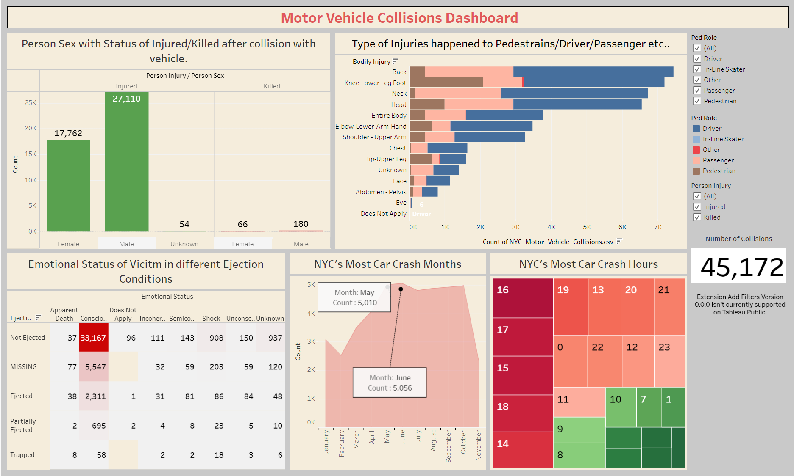

<h1 align="center">New York City's Motor Vehicle Collisions Analysis/h1>

- In urban areas, traffic accidents stand as a leading cause of injury and fatality, involving collisions between pedestrians, motor vehicles, and other road users like cyclists. 

- Three primary impact types occur: those on the vehicle, the occupant's state, and the organs within the occupant's body. Moreover, each collision incorporates essential elements such as ejection occurrences, complaints, incident time, and date. 

- Analyzing these aspects post-collision aids in uncovering the reasons behind the accident, enabling the prevention of future incidents—an integral part of the accident investigation process.

We extracted information from **NYC | OpenData**, a repository of free public data provided by various New York City agencies and partners. The dataset, sourced from a 2021 collision in New York involving a person and a motor vehicle, excludes incidents with injuries or deaths costing less than $1,000. The data includes details such as the date and time of the occurrence, the injury location, and the police description. 

You can access the dataset here: https://data.cityofnewyork.us/Public-Safety/Motor-Vehicle-Collisions-Person/f55k-p6yu

  

Dashboard Link : https://public.tableau.com/app/profile/smit.rana6369/viz/NYC_vehcile_collisions/Dashboard1

These insights are found after analysis:
- In traffic accidents, injuries outnumber fatalities, and males tend to experience more harm and fatalities than females. The majority of individuals who reported discomfort attributed it to pain or nausea.
- When accidents happen, most individuals remain inside the vehicle due to seatbelt use and consciousness, which is a positive indication. 
- Drivers are particularly susceptible, facing more bodily injuries than pedestrians and passengers. Injuries to the back, neck, and knees are prevalent among drivers.
- Car accidents are prevalent in all directions between 2 and 4 a.m., and the frequency increases over time, peaking between 3 and 5 p.m. Subsequently, accident rates decrease after the evening hours. 
- Notably, the months of May and June in 2021 have the highest likelihood of being associated with a vehicular accident.

## Contact

Author: Smit Rana

LinkedIn: https://www.linkedin.com/in/smit98rana/

        

